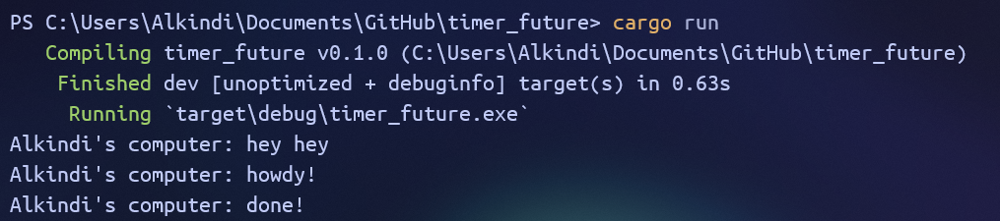
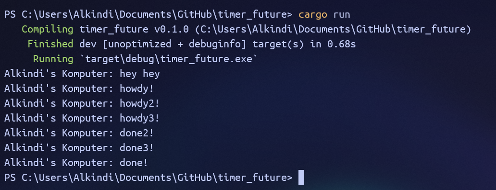
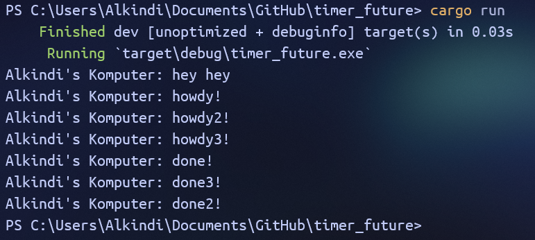
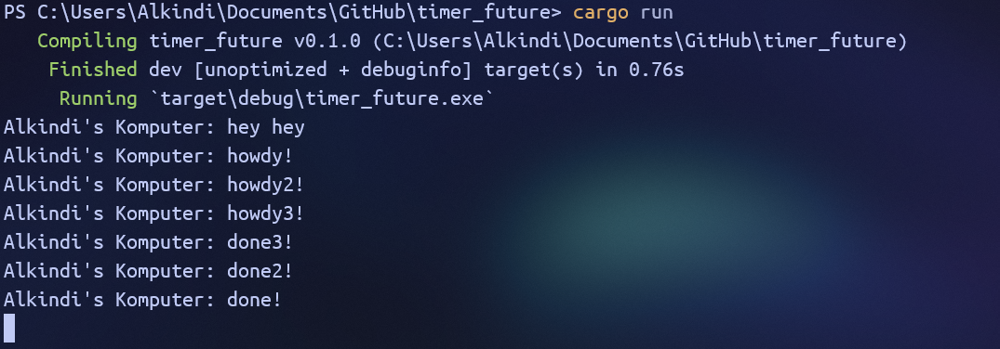

# Tutorial 10 - Part 1: Timer

## 1.2 Understanding how it works

We can see that the line outside of the spawner (`Alkindi's Komputer: hey hey`) is printed before the lines in the async function.
This is because the print function for said line is run in the main thread before `executor.run` is called,
which is responsible for running the async function thats in the spawner's task queue.
Once the async function is called, the line `Alkindi's Komputer: howdy!` is printed with the other line (`Alkindi's Komputer: done!`)
printed 2 seconds later.

## 1.3 Multiple Spawn and removing drop

With `drop(spawner)`:  

Without `drop(spawner)`:  

As we can see, the order of the `howdy` line and its corresponding `done` line gets printed is different in all three screenshots.
This is because the run order of async functions in the `spawner`'s task queue is up to the `executor`, which may run it differently from the initial placement in the queue.

We can also see that the program without the `drop(spawner)` line (image 3) is still running even after printing everything because the executor doesn't know that the program has finished receiving incoming tasks to run.
This is because the `drop(spawner)` statement is responsible for closing/dropping the `spawner` so that the `executor` knows it's not receiving any more tasks.
